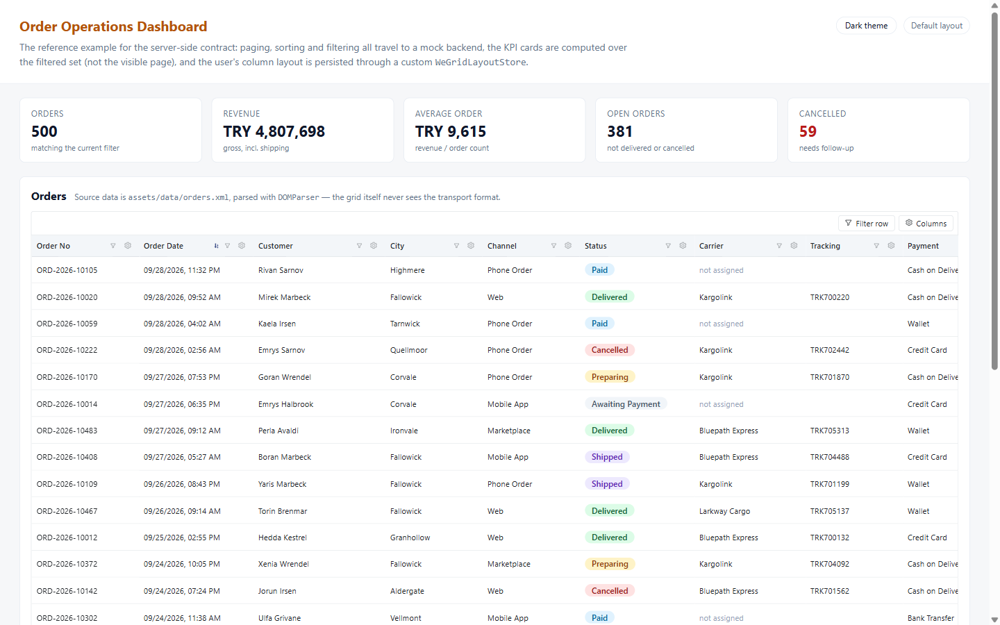
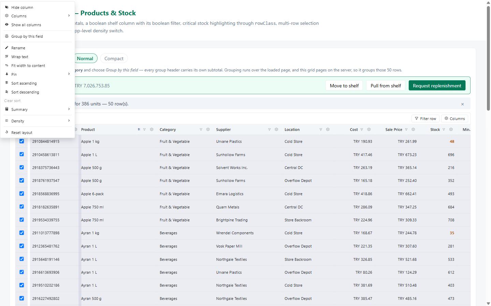
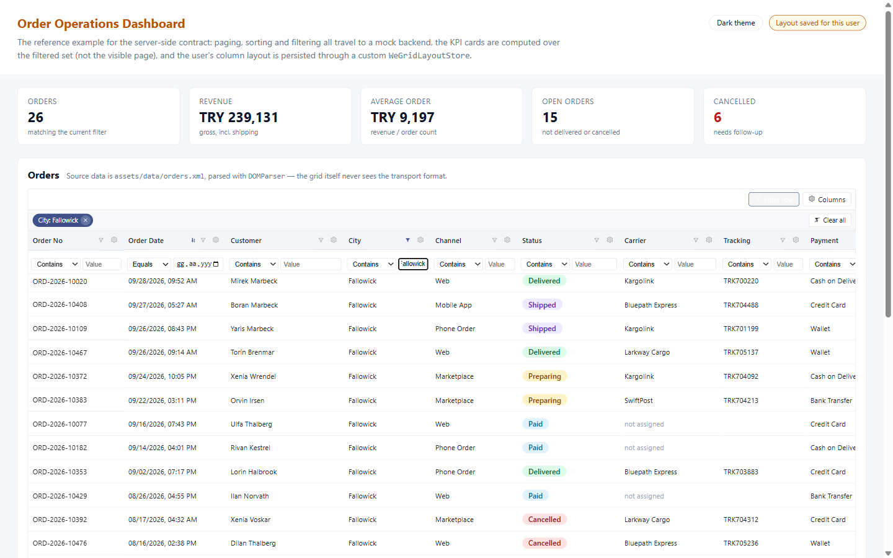
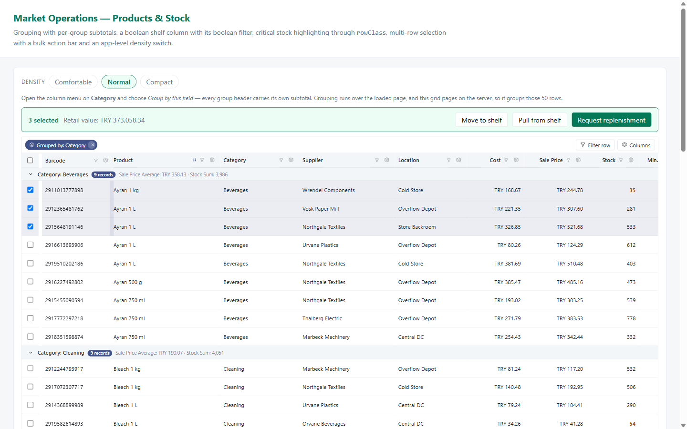
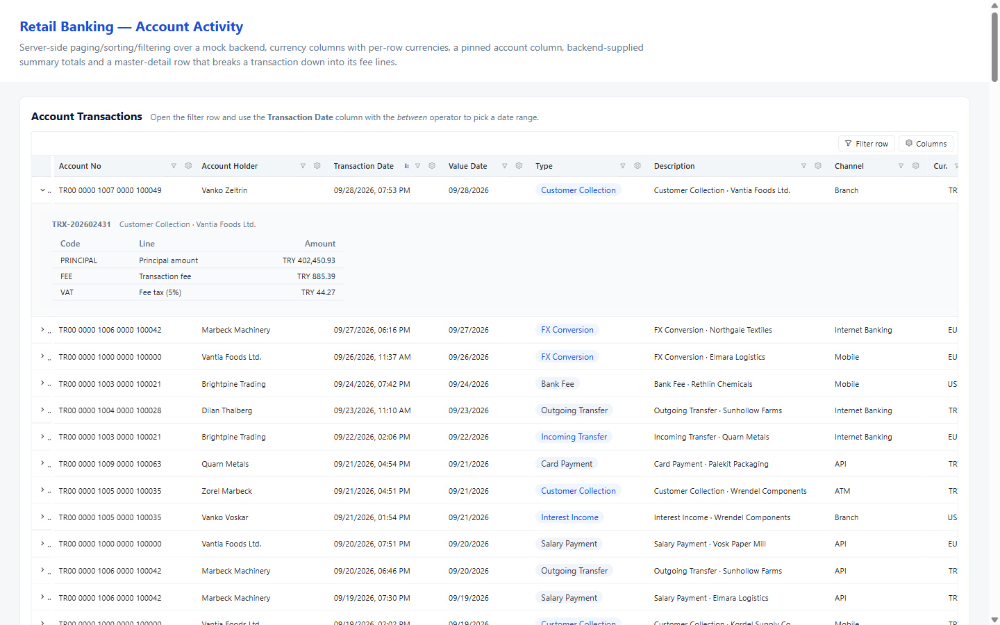
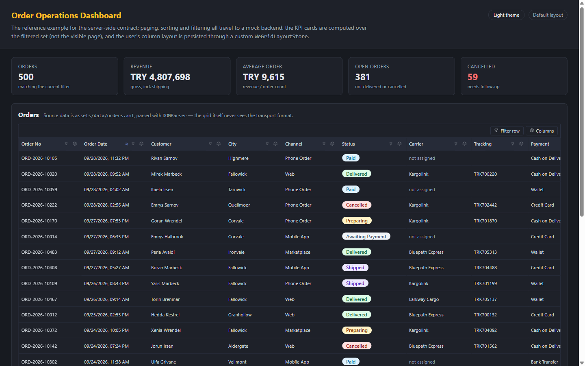
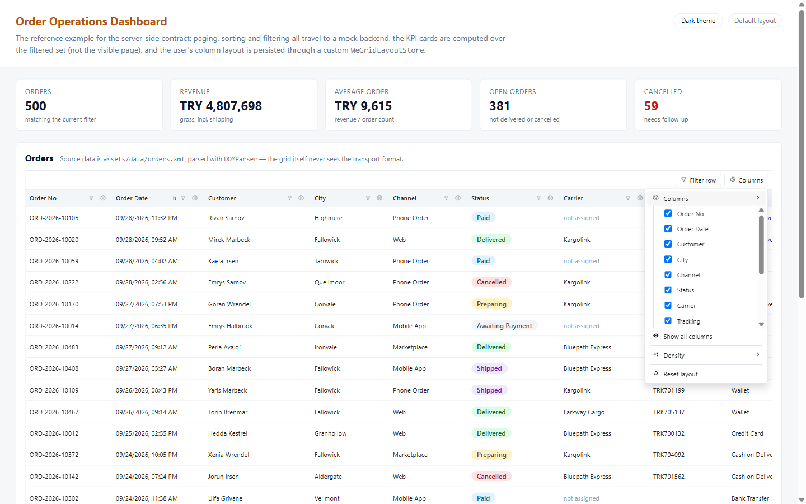

# we-grid-angular

[](https://www.npmjs.com/package/we-grid-angular)
[](https://www.npmjs.com/package/we-grid-angular)
[](https://github.com/emrecirik/we-grid/actions/workflows/ci.yml)
[](LICENSE)
[](https://angular.dev)
[](docs/theming.md)

[Türkçe](README.tr.md)

A free, themeable Angular data grid with **no styling-framework dependency** — no Bootstrap, no
Material, no icon font. Standalone components and directives on top of Angular CDK.



## Features

- Column hide/show, rename, drag-to-reorder, resize, pin (left/right), autofit-to-content
- Density modes (comfortable / normal / compact)
- Per-user layout persisted automatically (localStorage by default, pluggable backend store)
- Filter row + a per-column filter popover, with active-filter chips
- Single-level grouping with collapsible sections and per-group summaries
- Subtotal (summary) row: sum / average / min / max / count, per column
- Master-detail row expansion via a `weGridRowDetail` template
- Server-side pagination, sorting, and filtering (opt-in, auto-detected from your event bindings)
- Fully localizable UI text (`WE_GRID_LOCALE`) and swappable icon set (`WE_GRID_ICONS`, inline
  SVG — no icon font dependency)
- Theming via plain CSS custom properties (`--we-grid-*`), light/dark out of the box

## Installation

```bash
npm install we-grid-angular @angular/cdk
```

Peer dependencies: `@angular/core`, `@angular/common`, `@angular/forms`, `@angular/cdk` (Angular 18.x).

Add the CDK overlay stylesheet (used for the header/filter context menus) to your app's global
styles, and optionally the bundled default theme:

```json
// angular.json
"styles": [
  "node_modules/@angular/cdk/overlay-prebuilt.css",
  "node_modules/we-grid-angular/styles/we-grid-theme.scss",
  "src/styles.scss"
]
```

## Quick start

```ts
import { Component } from '@angular/core';
import { WeGridComponent, WeGridColumnDef } from 'we-grid-angular';

interface Product {
  id: number;
  code: string;
  name: string;
  price: number;
}

@Component({
  standalone: true,
  imports: [WeGridComponent],
  template: `
    <we-grid gridKey="products" [columns]="columns" [data]="products" trackByField="id"></we-grid>
  `
})
export class ProductListComponent {
  columns: WeGridColumnDef<Product>[] = [
    { field: 'code', header: 'Code', width: 120 },
    { field: 'name', header: 'Name', width: 220 },
    { field: 'price', header: 'Price', type: 'currency', width: 130, summary: 'sum' }
  ];
  products: Product[] = [/* ... */];
}
```

`gridKey` is required — the user's column layout is persisted under this key, so keep it unique
per grid instance.

## What it looks like

Every screenshot below is a real screen from one of the sample applications in this repository —
see the [screen gallery](https://emrecirik.github.io/we-grid/) for all of them on one page.

### The column menu — everything the end user can change

Right-click any header (or use the ⚙ button) to hide, rename, pin, sort, autofit, set a subtotal
function, switch density, group by the column, or reset the layout. Whatever they pick is saved
per user and per `gridKey`.



### Filter row, filter chips and live totals

The filter row gives every column an operator and a value; active filters become removable chips.
With `serverSide` on, each change is just an event — the KPI cards and the subtotal row in this
sample are recomputed by the backend over the whole filtered set, not the visible page.



### Grouping with per-group subtotals, and row selection



### Master-detail rows and pinned columns



### Dark theme

Dark mode is a single `data-theme="dark"` attribute on an ancestor element — no grid input, no
extra bundle. Every colour is a `--we-grid-*` custom property you can override.



### Column visibility



## Examples

Three full sample applications live in [`SampleUsageProjects/`](SampleUsageProjects/README.md), each
registered in this workspace and runnable with the Angular CLI:

| App | Shows |
|---|---|
| [`banking`](SampleUsageProjects/banking) | Currency columns with mixed per-row currencies, a pinned column, date-range filtering, backend-supplied totals, master-detail rows |
| [`retail-market`](SampleUsageProjects/retail-market) | Grouping with subtotals, boolean column + filter, `rowClass` highlighting, multi-select with bulk actions, density switching |
| [`ecommerce-dashboard`](SampleUsageProjects/ecommerce-dashboard) | The server-side reference example: paging/sorting/filtering against a mock backend, KPI cards, `displayValue` status badges, a custom layout store, XML data source, a dark-theme switch |

```bash
npm install
npm run build:lib                 # build the library first
npm run start:ecommerce           # then any sample app
```

## Documentation

- [Getting started](docs/getting-started.md)
- [API reference](docs/api.md)
- [Server-side pagination/sorting/filtering](docs/server-side.md)
- [Theming](docs/theming.md)
- [Localization](docs/localization.md)
- [Can I use this from React?](docs/react.md)

## Development

This repo is an Angular CLI workspace with the library at `projects/we-grid`, a feature sandbox at
`projects/playground`, and the three sample apps under `SampleUsageProjects/`.

```bash
npm install
npm run build:lib     # build the library into dist/we-grid
npm test              # 92 unit tests, headless Chrome
npm start             # run the playground app
```

## Contributing

Issues and pull requests are welcome — see [CONTRIBUTING.md](CONTRIBUTING.md).

## License

MIT — see [LICENSE](LICENSE). Free to use, including commercially.
