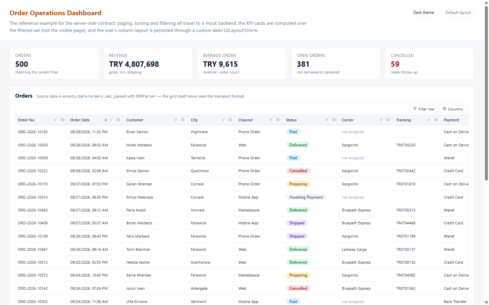
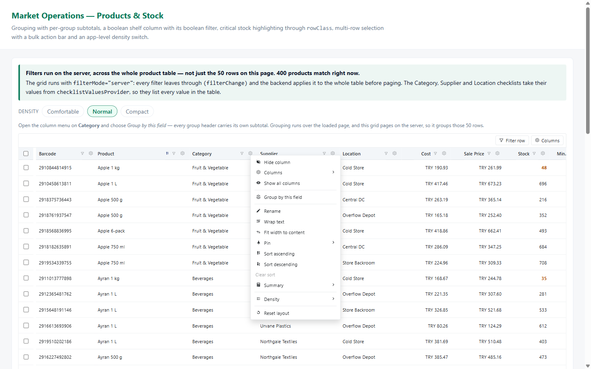
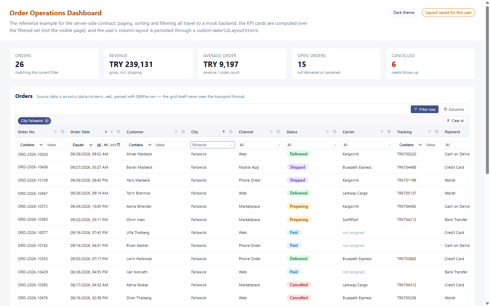
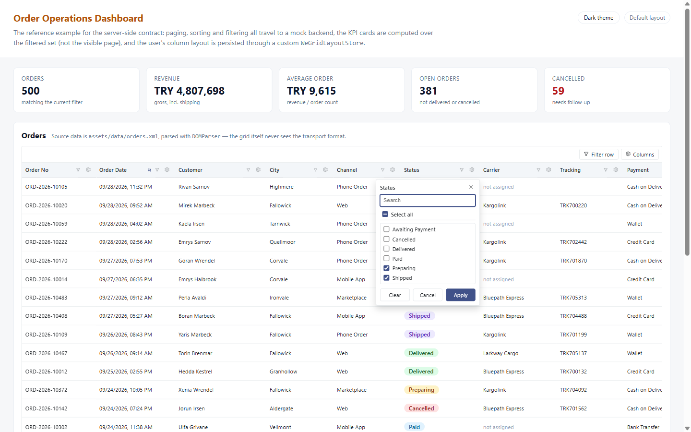
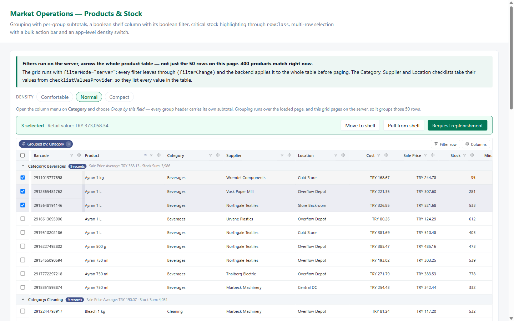
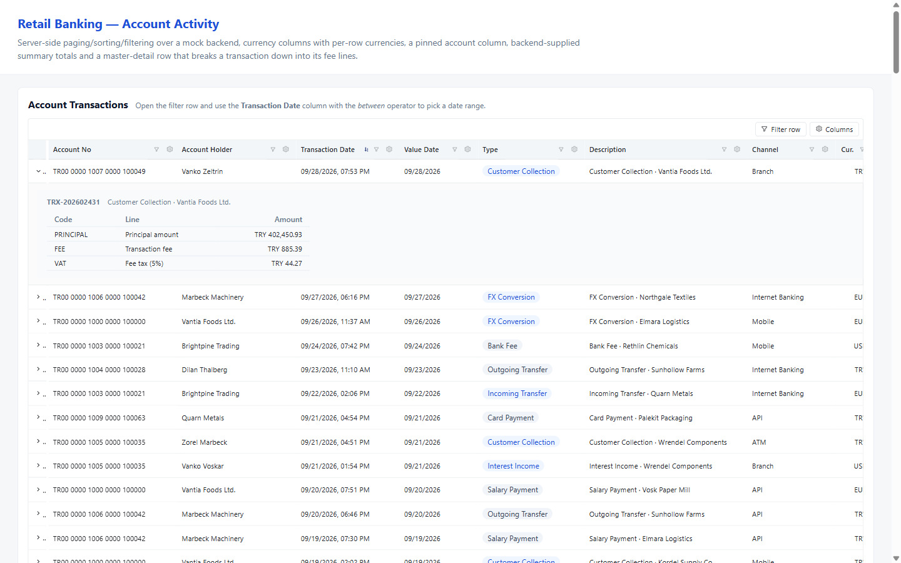
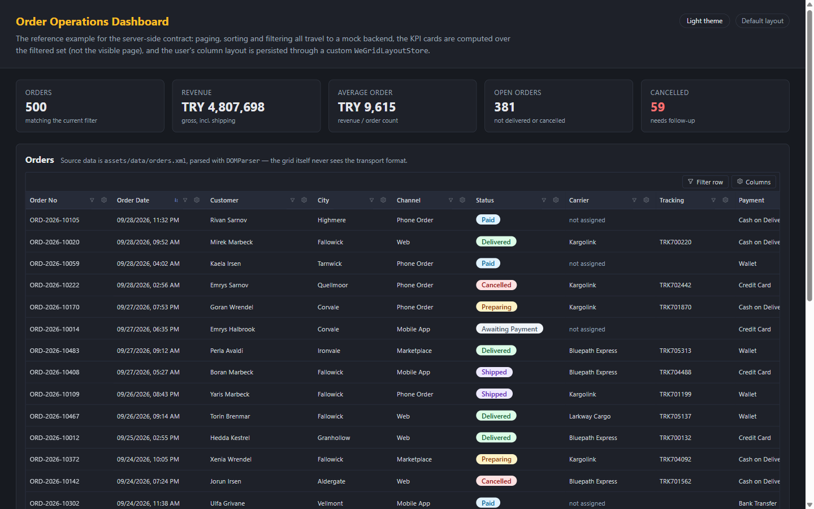
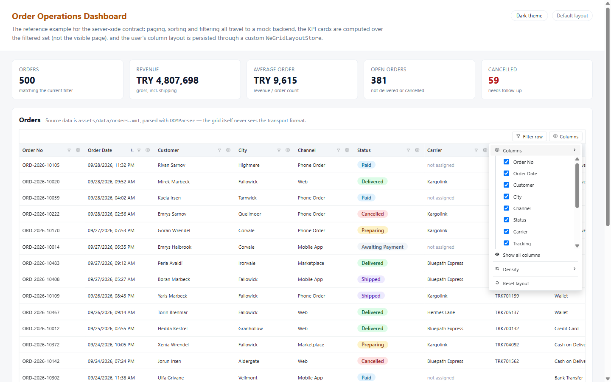

# we-grid-angular

[](https://www.npmjs.com/package/we-grid-angular)
[](https://www.npmjs.com/package/we-grid-angular)
[](https://github.com/emrecirik/we-grid/actions/workflows/ci.yml)
[](LICENSE)
[](https://angular.dev)
[](docs/theming.md)

[Türkçe](README.tr.md)

A free, themeable Angular data grid with **no styling-framework dependency** — no Bootstrap, no
Material, no icon font. Standalone components and directives on top of Angular CDK.



## Features

- Column hide/show, rename, drag-to-reorder, resize, pin (left/right), autofit-to-content
- Density modes (comfortable / normal / compact)
- Per-user layout persisted automatically (localStorage by default, pluggable backend store)
- Excel/DevExpress-style checklist header filter **on every column by default**: tick the distinct
  values, one `'in'` filter leaves — from the loaded rows, or from the whole dataset through
  `checklistValuesProvider`
- Filter row + a per-column operator popover (contains, =, >, <, between, date ranges), with
  active-filter chips
- Column types for what your data really stores: `number`, `integer`, `currency` — including
  amounts kept in **kuruş / cents** (`minorUnits: true`) — `percent`, `date`, `datetime`, `time`,
  `boolean`, and `email` / `url` / `phone` links, plus a per-column `formatter`
- Per-column operator restriction (`filterOperators`) for fields the backend can only match one way
- Locale-aware values: `weGridLocaleTr` formats `1.234,50` / `11.09.2026`, matches "İSTANBUL" for
  "istanbul" and sorts Ç/Ş/İ where the Turkish alphabet puts them
- Single-level grouping with collapsible sections and per-group summaries
- Subtotal (summary) row: sum / average / min / max / count, per column
- Master-detail row expansion via a `weGridRowDetail` template
- Server-side pagination, sorting, and filtering — filters reach your backend and search the **whole
  table**, not just the loaded page ([how](docs/server-side.md))
- Fully localizable UI text (`WE_GRID_LOCALE`) and swappable icon set (`WE_GRID_ICONS`, inline
  SVG — no icon font dependency)
- Export to CSV, Excel (`.xlsx`) and PDF, and import from CSV/Excel — no runtime dependency added
- Inline row create/update/delete with a `done` callback per commit, built for a real backend
- Theming via plain CSS custom properties (`--we-grid-*`), light/dark out of the box

## Installation

```bash
npm install we-grid-angular @angular/cdk
```

Peer dependencies: `@angular/core`, `@angular/common`, `@angular/forms`, `@angular/platform-browser`,
`@angular/cdk` — Angular **18.2 through 22** are supported. Every major in that range is verified
by CI, which installs the packed tarball into a freshly scaffolded app of that version and builds it.

Add the CDK overlay stylesheet (used for the header/filter context menus) to your app's global
styles, and optionally the bundled default theme:

```json
// angular.json
"styles": [
  "node_modules/@angular/cdk/overlay-prebuilt.css",
  "node_modules/we-grid-angular/styles/we-grid-theme.scss",
  "src/styles.scss"
]
```

## Quick start

```ts
import { Component } from '@angular/core';
import { WeGridComponent, WeGridColumnDef } from 'we-grid-angular';

interface Product {
  id: number;
  code: string;
  name: string;
  price: number;
}

@Component({
  standalone: true,
  imports: [WeGridComponent],
  template: `
    <we-grid gridKey="products" [columns]="columns" [data]="products" trackByField="id"></we-grid>
  `
})
export class ProductListComponent {
  columns: WeGridColumnDef<Product>[] = [
    { field: 'code', header: 'Code', width: 120 },
    { field: 'name', header: 'Name', width: 220 },
    { field: 'price', header: 'Price', type: 'currency', width: 130, summary: 'sum' }
  ];
  products: Product[] = [/* ... */];
}
```

`gridKey` is required — the user's column layout is persisted under this key, so keep it unique
per grid instance.

### Column types and formatters

```ts
columns: WeGridColumnDef<Product>[] = [
  { field: 'stock', header: 'Stock', type: 'integer', summary: 'sum' },
  { field: 'priceKurus', header: 'Price', type: 'currency', format: 'TRY', minorUnits: true }, // 12345 → ₺123,45
  { field: 'discount', header: 'Discount', type: 'percent' },                                  // 0.25 → %25
  { field: 'weight', header: 'Weight', type: 'number', formatter: (v) => `${v} kg` },
  { field: 'opensAt', header: 'Opens', type: 'time' },
  { field: 'email', header: 'E-mail', type: 'email' },                                         // mailto: link
  { field: 'website', header: 'Website', type: 'url' }
];
```

A `minorUnits` column is shown and typed in lira but stored, sorted, summed and **emitted in
kuruş**, so a filter "Price > 500" reaches your backend as `50000`. All types:
[column-types.md](docs/column-types.md).

### Filtering 3,000 rows when only 20 are loaded

The grid renders exactly what is in `data`. If you load one page at a time, a filter the grid runs
itself can only see that page. To search the whole table, let the filters go to your backend:

```html
<we-grid gridKey="products" [columns]="columns" [data]="rows" [loading]="loading"
         [serverSide]="true" [totalCount]="totalCount" [page]="page" [pageSize]="20"
         (pageChange)="onPageChange($event)"
         filterMode="server" (filterChange)="onFilterChange($event)"
         [checklistValuesProvider]="checklistValues"></we-grid>
```

```ts
onFilterChange(e: WeGridFilterChangeEvent): void {
  this.filters = [...e];            // [{ field: 'name', operator: 'contains', value: 'bolt' }, …]
  if (e.resetPage) this.page = 1;
  this.load();                      // backend: WHERE <filters> → COUNT(*) → ORDER BY → OFFSET/FETCH
}

// checklists list the values of the whole table, not just this page
checklistValues: WeGridChecklistValuesProvider = (req) => this.http.post('/api/products/distinct-values', req);
```

The full walkthrough — component, request body, every operator, EF Core and SQL, and a table of
"only this page is searched" causes — is in [server-side.md](docs/server-side.md).

## What it looks like

Every screenshot below is a real screen from one of the sample applications in this repository —
see the [screen gallery](https://emrecirik.github.io/we-grid/) for all of them on one page.

### The column menu — everything the end user can change

Right-click any header (or use the ⚙ button) to hide, rename, pin, sort, autofit, set a subtotal
function, switch density, group by the column, or reset the layout. Whatever they pick is saved
per user and per `gridKey`.



### Filter row, filter chips and live totals

The filter row gives every column an operator and a value; active filters become removable chips.
With `serverSide` on, each change is just an event — the KPI cards and the subtotal row in this
sample are recomputed by the backend over the whole filtered set, not the visible page.



### Checklist header filter — tick the values, not the operator

Every filterable column gets it by default (`headerFilterMode="operator"` on the grid switches back
to operator popovers, or set it per column): its funnel icon lists the distinct values of the loaded
rows — or of the whole table with `checklistValuesProvider` — searchable, with a select-all box and an entry for
blanks — and the selection leaves as one `'in'` filter carrying the raw codes, which the backend
turns into a single `IN (…)` over the whole table. `displayValue` supplies the labels, so the user
ticks "Shipped" while the query gets `40`.



### Grouping with per-group subtotals, and row selection



### Master-detail rows and pinned columns



### Dark theme

Dark mode is a single `data-theme="dark"` attribute on an ancestor element — no grid input, no
extra bundle. Every colour is a `--we-grid-*` custom property you can override.



### Column visibility



## Examples

Three full sample applications live in [`SampleUsageProjects/`](SampleUsageProjects/README.md), each
registered in this workspace and runnable with the Angular CLI:

| App | Shows |
|---|---|
| [`banking`](SampleUsageProjects/banking) | Currency columns with mixed per-row currencies, loan amounts stored in **kuruş** (`minorUnits`) and rates as `percent`, a pinned column, date-range filtering, backend-supplied totals, master-detail rows |
| [`retail-market`](SampleUsageProjects/retail-market) | **Filtering the whole product table on the server**, not the 50 loaded rows, with checklist values from `checklistValuesProvider`; grouping with subtotals, `integer` columns, `rowClass` highlighting, multi-select with bulk actions, density switching |
| [`ecommerce-dashboard`](SampleUsageProjects/ecommerce-dashboard) | The server-side reference example: paging/sorting/filtering against a mock backend, checklist header filters fed from the whole dataset, KPI cards, `displayValue` status badges, a custom layout store, XML data source, a dark-theme switch |

```bash
npm install
npm run build:lib                 # build the library first
npm run start:ecommerce           # then any sample app
```

## Documentation

- [Getting started](docs/getting-started.md)
- [Column types and formatters](docs/column-types.md) — `integer`, `percent`, kuruş/cents `currency`, `time`, links, `formatter`
- [API reference](docs/api.md)
- [Server-side pagination/sorting/filtering](docs/server-side.md) — **filtering the whole table, not just the loaded page**
- [Export and import (CSV / Excel / PDF)](docs/export-import.md)
- [Inline row editing](docs/row-editing.md)
- [Theming](docs/theming.md)
- [Localization](docs/localization.md)
- [Can I use this from React?](docs/react.md)

## Development

This repo is an Angular CLI workspace with the library at `projects/we-grid`, a feature sandbox at
`projects/playground`, and the three sample apps under `SampleUsageProjects/`.

```bash
npm install
npm run build:lib     # build the library into dist/we-grid
npm test              # 282 unit tests, headless Chrome
npm start             # run the playground app
```

## Contributing

Issues and pull requests are welcome — see [CONTRIBUTING.md](CONTRIBUTING.md).

## License

MIT — see [LICENSE](LICENSE). Free to use, including commercially.
